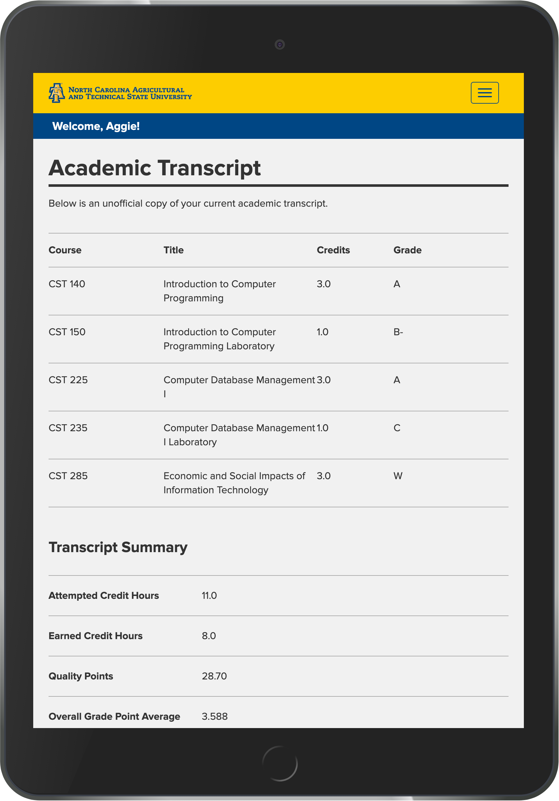
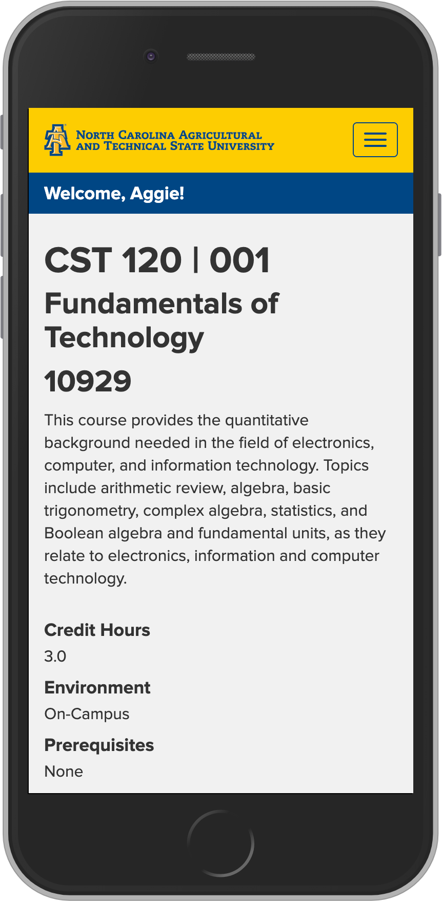

# Aggie Access Student Information System
The main goal of this project is to redesign the very outdated and unorganized student information system at North Carolina Agricultural and Technical State University, known as Aggie Access. Aggie Access is utilized every day by both students who attended the university and employees who work for the university. However, since the current version of Aggie Access is so outdated and unorganized, it makes it difficult for these individuals to complete their tasks on the system, so we believe that all parties would largely benefit from a much-needed system redesign. By redesigning this system, we hope to improve the everyday tasks that are carried out by the employees and students who utilize the system's web interface on a daily basis. This redesigned system will use Hypertext Markup Language (HTML) as its structural foundation; Cascading Style Sheets (CSS) for its design stylings; JavaScript for client-side event handling; Hypertext Preprocessor (PHP) for database implementation with each webpage; Structured Query Language (SQL) for selections, insertions, updates, and deletions with the system's database; and MySQL as its relational database management system. In addition, the redesigned system will be fully functional on mobile devices, including both Android and iOS smartphones and tablets, which makes the system even friendlier for the end-users.

## Screenshots

  
  <em>The system's homepage as displayed on desktop devices.</em>
     
  &nbsp;&nbsp;&nbsp;&nbsp;&nbsp;&nbsp;&nbsp;&nbsp;&nbsp;&nbsp;
  
   
  <em>The system's academic transcript and course information webpages as displayed on mobile devices.</em>

 

## Built With
* [Hypertext Markup Language (HTML)](https://whatwg.org/) - The foundation for the system's web interface
* [Cascading Style Sheets (CSS)](https://www.w3.org/Style/CSS/) - Used to stylize the system's web interface
* JavaScript - Used for client-side event handling
* [jQuery](https://jquery.com/) - JavaScript library used for webpage manipulation
* [Hypertext Preprocessor (PHP)](https://www.php.net/) - Used for server-side database implementation with webpages
* Structured Query Language (SQL) - Used for interactions with the system's database
* [MySQL](https://www.mysql.com/) - Relational database management system used for the software
* [Bootstrap 3.4.0](https://getbootstrap.com/docs/3.4/getting-started/) - Front-end framework used for flexible, responsive webpage development

## Project Team
All of the contrubutions made to this software system were part of the project team's senior capstone project in CST 498 and CST 499 at North Carolina Agricultural and Technical State University during the Spring 2019 and Fall 2019 semesters, respectively. The following individuals contributed to the development of the software system in its entirety:
* [Travon Bland](https://github.com/tlbland)
* [Carson Calcutt](https://github.com/carsoncalcutt)
* [Tonya McClendon](https://github.com/mcclendont23)
